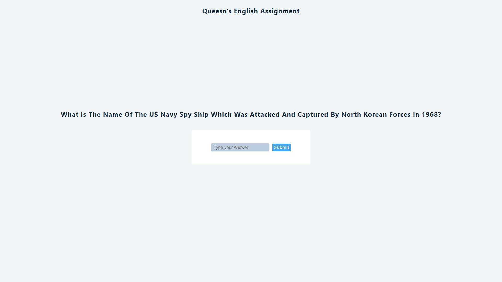

# Queen's English Assignment React App

### To run the app locally please follow the steps mentioned below, go to your terminal and run following commands sequentially

```js
    $ git clone https://github.com/sidhant2709/queen-s-english-assignment.git
```
```js
    $ cd queen-s-english-assignment
```
```js
    $ npm install
```
```js
    $ npm start
```

[](https://sidhant-qe-trivia-question-assignment.netlify.app/)

<hr>

#### To view the deployed site, check out the [https://sidhant-qe-trivia-question-assignment.netlify.app/](https://sidhant-qe-trivia-question-assignment.netlify.app/).